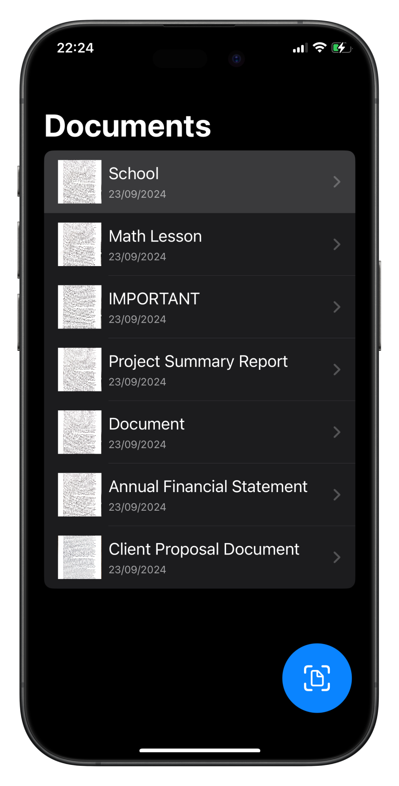
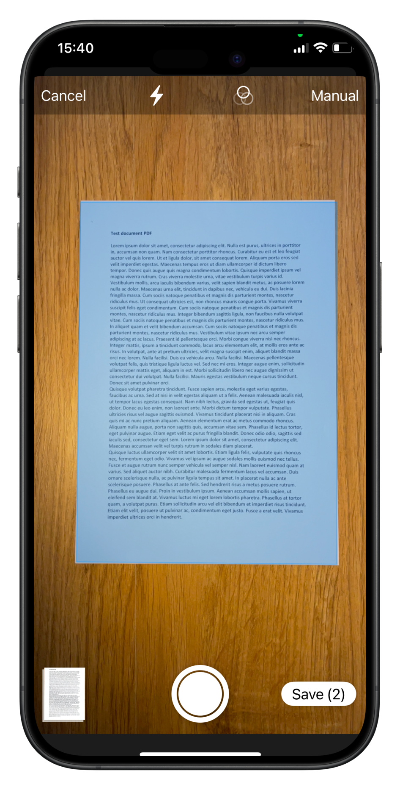
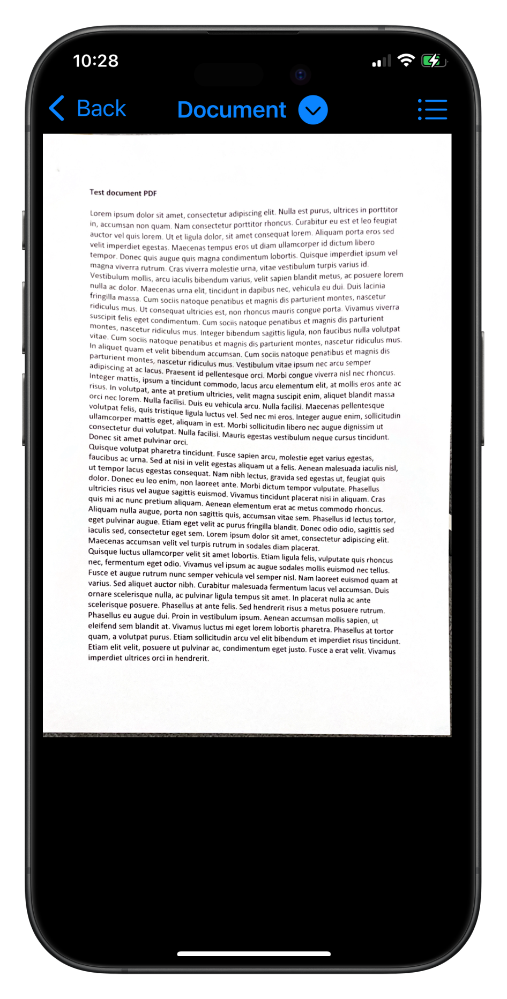
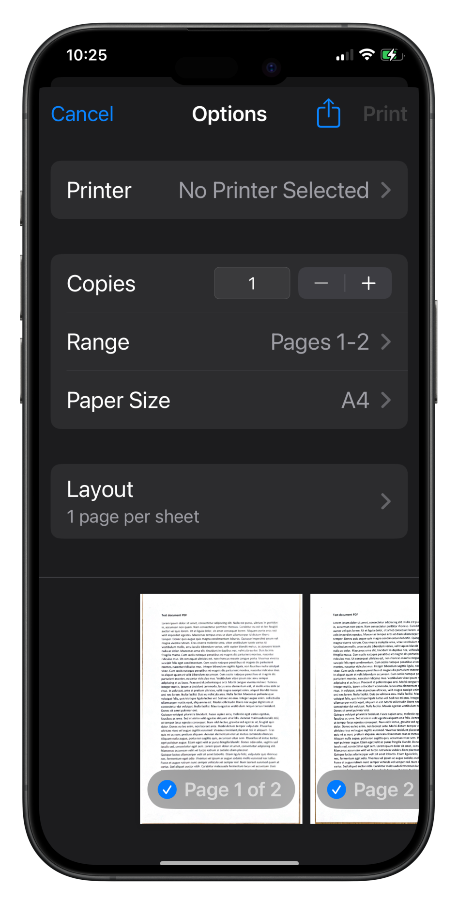

# Scanner Pro • Document & PDF

[](https://developer.apple.com/swift/) [](https://developer.apple.com/xcode/swiftui/)

## Introduction

**Scanner Pro • Document & PDF** is a SwiftUI-based iOS app for scanning, saving, printing, and sharing documents. Built for iOS 17+, it leverages the power of SwiftData to provide fast and reliable document management.

Key Features:
- Scan documents using the camera.
- Save scanned documents locally with SwiftData.
- Print documents directly from the app.
- Share documents via the iOS Share Sheet.
  
## Technologies

This project is powered by:
- **Swift 5.9**
- **SwiftUI** for a declarative UI.
- **SwiftData** for persistent document storage.
- **CoreGraphics** for managing scanned images.

## Table of Contents
1. [Installation](#installation)
2. [Features](#features)
3. [Screenshots](#screenshots)
4. [Code Overview](#code-overview)
5. [How It Works](#how-it-works)
6. [Contributing](#contributing)
7. [License](#license)

## Installation

### Prerequisites
- Xcode 15 or later
- iOS 17+ simulator or device

### Steps
1. Clone the repo:
   ```bash
   git clone https://github.com/alucchini/App-Scanner-iOS.git
   ```
2. Open `ScannerPro.xcodeproj` in Xcode.
3. Build and run the app on an iOS 17+ simulator or device.

## Features

### 1. Scan Documents
   - Use the built-in camera to scan physical documents.
   - The app supports cropping, enhancing the image quality, and handling multiple pages in one scan session.

### 2. Save and Organize Documents
   - Documents are saved locally using **SwiftData**.
   - Each document is tagged with metadata such as name, date, and format.

### 3. Print Documents
   - Integrated printing support to print scanned documents in high resolution.
   - The print feature uses **UIPrintInteractionController**.

### 4. Share Documents
   - Share scanned documents in PDF or image format using the native **Share Sheet**.
   - Support for sharing to cloud storage, email, social media, etc.

## Screenshots

| Home Screen | Scan Document | Document Detail | Print Preview |
|-------------|---------------|---------------|---------------|
|  |  |  |  |

## Code Overview

### 1. Models
The primary model is `Document`, which includes:
```swift
import SwiftData
import UIKit

@Model
final class Document {
    var name: String
    var images: [ImageData]
    var date: Date

    init(name: String, images: [ImageData], date: Date) {
        self.name = name
        self.images = images
        self.date = date
    }

    var preview: UIImage? {
        return images.first?.image
    }
}
```

This model is saved using **SwiftData** to ensure fast and reliable persistence:
```swift
@MainActor
class DocumentManager: ObservableObject {
    @Published var documents: [Document] = []
    
    func saveDocument(_ document: Document) {
        // Logic to save document to SwiftData
    }
}
```

### 2. Views

- **DocumentsView**: Displays a list of documents, with swipe actions to delete doc.
- **DocumentDetailView**: Allows the user to view, rename, print, share and manage individual documents.
  
Here’s how the document list is rendered:
```swift
List {
    ForEach(viewModel.documents) { document in
        NavigationLink(value: document){
            docRow(for: document)
        }
        .swipeActions(edge: .trailing) {
            Button(role: .destructive, action: {
                viewModel.deleteDoc(document)
            }) {
                Label("Delete", systemImage: "trash")
            }
        }
    }
}
```

### 3. Scanning Feature
The scanning functionality is implemented using the **VisionKit** framework for document detection:
```swift
import SwiftUI
import VisionKit

struct ScannerView: UIViewControllerRepresentable {
    let didFinishWith: ((_ result: Result<[UIImage], Error>) -> Void)
    let didCancel: () -> Void

    func makeUIViewController(context: Context) -> VNDocumentCameraViewController {
        let scannerViewController = VNDocumentCameraViewController()

        scannerViewController.delegate = context.coordinator

        return scannerViewController
    }

    func updateUIViewController(_ uiViewController: VNDocumentCameraViewController, context: Context) {  }


    func makeCoordinator() -> Coordinator {
        Coordinator(with: self)
    }

    class Coordinator: NSObject, VNDocumentCameraViewControllerDelegate {
        let scannerView: ScannerView

        init(with scannerView: ScannerView) {
            self.scannerView = scannerView
        }

        // The camera successfully completed a scan.
        func documentCameraViewController(_ controller: VNDocumentCameraViewController, didFinishWith scan: VNDocumentCameraScan) {
            let scannedPages: [UIImage] = (0..<scan.pageCount).compactMap { scan.imageOfPage(at: $0) }

            scannerView.didFinishWith(.success(scannedPages))
        }

        // The user canceled out of the document camera interface.
        func documentCameraViewControllerDidCancel(_ controller: VNDocumentCameraViewController) {
            scannerView.didCancel()
        }

        // The document scan failed or was unable to capture a photo.
        func documentCameraViewController(_ controller: VNDocumentCameraViewController, didFailWithError error: Error) {
            scannerView.didFinishWith(.failure(error))
        }
    }
}
```

### 4. Printing
Documents are converted to PDFs for printing using **UIPrintInteractionController**:
```swift
func printDocument(document: Document) {
    // Check if the document contains images
    guard !document.images.isEmpty else {
        print("Aucune image à imprimer")
        return
    }

    // Create an array of UIImages from document data
    let imagesToPrint = document.images.compactMap { $0.image }

    // Generate a PDF from images
    if let pdfURL = generatePDF(from: imagesToPrint) {
        // Create a UIPrintInteractionController to handle printing
        let printController = UIPrintInteractionController.shared

        // Configure print information
        let printInfo = UIPrintInfo(dictionary: nil)
        printInfo.jobName = document.name
        printInfo.outputType = .general
        printController.printInfo = printInfo

        // Provide the content to print (the PDF file)
        if let pdfData = try? Data(contentsOf: pdfURL) {
            printController.printingItem = pdfData
        } else {
            print("Erreur lors de la récupération des données du PDF")
        }

        // Show Print Dialog
        printController.present(animated: true, completionHandler: nil)
    } else {
        print("Erreur lors de la génération du PDF pour l'impression")
    }
}
```

### 5. PDF Generation
Here is the function that allows you to generate a PDF with the scanned images in SwiftUI:
```swift
func generatePDF(from images: [UIImage]) -> URL? {
    let pdfDocument = PDFDocument()

    for (index, image) in images.enumerated() {
        let pdfPage = PDFPage(image: image)
        pdfDocument.insert(pdfPage!, at: index)
    }

    // Save the PDF to the temporary folder
    let tempDirectory = FileManager.default.temporaryDirectory
    let pdfURL = tempDirectory.appendingPathComponent(UUID().uuidString).appendingPathExtension("pdf")

    do {
        try pdfDocument.dataRepresentation()?.write(to: pdfURL)
        return pdfURL
    } catch {
        print("Erreur lors de la génération du PDF : \(error)")
        return nil
    }
}
```

### 6. Sharing
Sharing is done via the native **ShareLink** in SwiftUI:
```swift
ShareLink(item: document, preview: SharePreview("Document", image: previewImage))
```

## How It Works

1. **Document Scanning**: Users can scan documents via the device camera, utilizing **VisionKit** for auto-detection and image processing.
2. **Document Management**: Scanned documents are stored using SwiftData, and can be organized, renamed, or deleted.
3. **Print Integration**: Users can print documents in high quality using iOS’s built-in printing functionality.
4. **Document Sharing**: The app uses **ShareLink** to easily share documents across various apps.

## Contributing

We welcome contributions! Please follow these steps:
1. Fork the repo.
2. Create a feature branch: `git checkout -b feature/your-feature`.
3. Commit your changes: `git commit -m 'Add new feature'`.
4. Push to the branch: `git push origin feature/your-feature`.
5. Submit a pull request.

## License

This project is licensed under the MIT License - see the [LICENSE](LICENSE) file for details.
